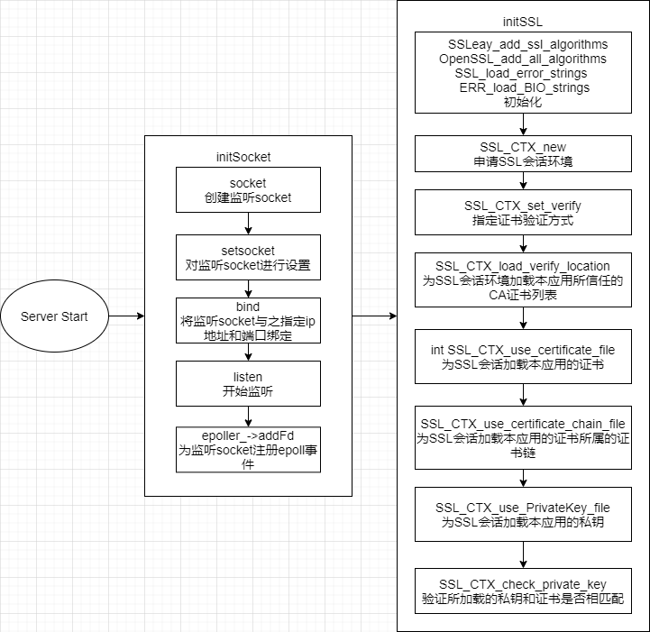
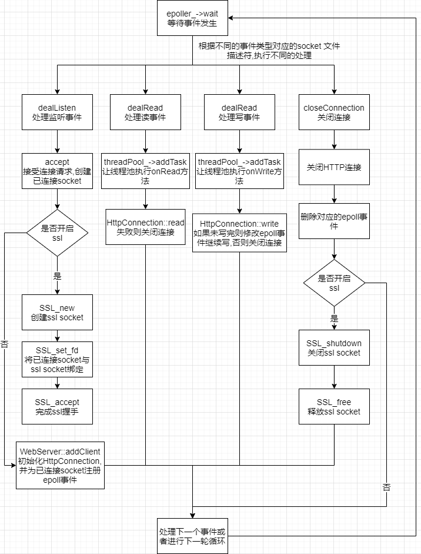

<!--
 * @Author: starrysky9959 965105951@qq.com
 * @Date: 2022-10-16 15:14:19
 * @LastEditors: starrysky9959 starrysky9651@outlook.com
 * @LastEditTime: 2022-11-10 00:12:56
 * @Description: 
-->
# HTTP/HTTPS Server
## 实验要求说明

​使用C语言实现最简单的HTTP服务器

1. 同时支持HTTP（80端口）和HTTPS（443端口）：使用两个线程分别监听各自端口
2. 只需支持GET方法，解析请求报文，返回相应应答及内容

| **需支持的状态码**    | **场景**                                                     |
| --------------------- | ------------------------------------------------------------ |
| 200 OK                | 对于443端口接收的请求，如果程序所在文件夹存在所请求的文件，返回该状态码，以及所请求的文件 |
| 301 Moved Permanently | 对于80端口接收的请求，返回该状态码，在应答中使用Location字段表达相应的https URL |
| 206 Partial Content   | 对于443端口接收的请求，如果所请求的为部分内容（请求中有Range字段），返回该状态码，以及相应的部分内容 |
| 404 Not Found         | 对于443端口接收的请求，如果程序所在文件夹没有所请求的文件，返回该状态码 |

​最后HTTP服务器能够满足两项要求：

1. 正确性测试：构建拓扑之后，在主机h1上运行HTTP服务器程序，在主机h2上运行给定的测试程序，验证程序正确性。
2. 使用HTTP服务器分发视频：在主机h1上运行HTTP服务器程序，在主机h2上运行vlc，通过网络获取并播放该小视频。通过抓包分析HTTP服务器和vlc客户端是如何传输视频文件的。


## build
``` bash
mkdir build
cd build
cmake ..
make
cd ..
sudo build/lab1 # if use 80 and 443 port
```
## 实验设计与实现
项目整体目录结构如下所示。
``` 
.
├── CMakeLists.txt                  # 使用CMake构建本项目
├── keys                            # 自签名证书
│   ├── cert.csr
│   ├── cert.pem
│   ├── cnlab.cert
│   ├── cnlab.prikey
│   └── privkey.pem
├── resources                       # 资源文件和用于测试的Python文件
│   ├── dir
│   │   ├── index.html
│   ├── images                      # 图片
│   │   ├── 1.jpg
│   ├── index.html
│   ├── test
│   │   └── test.py                 # 功能测试脚本
│   ├── topo.py                     # 在Mininet中生成网络拓扑
│   └── video                       # 视频
│       └── test.mp4
└── src                             # 源码
    ├── buffer                      # 缓冲区
    │   ├── Buffer.cpp
    │   └── Buffer.h
    ├── http                        # 处理HTTP和HTTPS报文
    │   ├── HttpConnection.cpp
    │   ├── HttpConnection.h
    │   ├── HttpRequest.cpp
    │   ├── HttpRequest.h
    │   ├── HttpResponse.cpp
    │   └── HttpResponse.h
    ├── main.cpp                    # 主程序
    ├── pool                        # 线程池
    │   └── ThreadPool.h
    ├── server                      # 服务器主体和对epoll的封装
    │   ├── Epoller.cpp
    │   ├── Epoller.h
    │   ├── WebServer.cpp
    │   └── WebServer.h
    └── util                        # 公用代码, 全局变量等
        └── Util.h
```

### Buffer
`Buffer`类是对`char`的封装，实现自动增长的缓冲区，记录了当前已经读取的位置`readPos`和已经写入的位置`writePos`，便于处理请求报文和响应报文。
```cpp
// Buffer类的部分成员变量
std::vector<char> buffer;
std::atomic<std::size_t> readPos;
std::atomic<std::size_t> writePos;
```

### HttpRequest
`HttpRequest`类用于描述和解析HTTP请求报文。基于有限状态机的理论来逐步解析HTTP请求报文，根据HTTP请求报文的格式，可以分为以下四个解析阶段（空行部分由于相对简单直接跳过）。
```cpp
// HTTP请求解析阶段
enum PARSE_STATE {
    REQUEST_LINE, 
    HEADER,
    // BLANK_LINE,
    BODY,
    FINISH,
};
```

解析过程和状态转移如下所示，`util::ENDLINE_FLAG`表示换行符`\r\n`。`parsePath`和`parseHeader`的具体实现，使用正则表达式进行匹配。
```cpp
while (buffer.readableBytes() && state_ != PARSE_STATE::FINISH) {
    // return buffer.beginWriteConst() if does not find the END_FLAG
    auto lineEnd = std::search(buffer.peek(), buffer.beginWriteConst(), util::ENDLINE_FLAG.begin(), util::ENDLINE_FLAG.end());
    std::string line(buffer.retrieveUntilToString(lineEnd));
    switch (state_) {
    case PARSE_STATE::REQUEST_LINE:
        if (!parseRequestLine(line)) {
            return false;
        }
        parsePath();
        break;
    case PARSE_STATE::HEADER:
        parseHeader(line);
        if (buffer.readableBytes() <= util::ENDLINE_FLAG.size()) {
            state_ = PARSE_STATE::FINISH;
        }
        break;
    case PARSE_STATE::BODY:
        parseBody(line);
        break;
    default:
        break;
    }

    if (lineEnd == buffer.beginWriteConst()) break;
    buffer.retrieve(util::ENDLINE_FLAG.size());
}
```

### HttpResponse
`HttpResponse`类用于描述和生成HTTP响应报文。

```cpp
// HttpResponse类的部分成员变量
std::string srcDir_;    // 服务器根目录
std::string path_;      // 所请求文件的路径
std::unordered_map<std::string, std::string> header_;   // 响应报文header
int code_;              // 状态码
// Linux文件的内存共享映射
char *mmFile_;
struct stat mmFileStat_;
```

根据所请求文件是否存在或合法访问、是否需要重定向、是否为范围请求等决定响应报文的状态码，然后依次填充State Line、Header、Content等内容
```cpp
// check whether the file exists
// function stat() save file infomation in the specified stat according to the file name
if (stat((srcDir_ + path_).data(), &mmFileStat_) < 0 || S_ISDIR(mmFileStat_.st_mode)) {
    code_ = 404;
} 
else if (needRedirect) {
    code_ = 301;
} else if (!(mmFileStat_.st_mode & S_IROTH)) { // file authority
    code_ = 403;
} else if (header_.find("Range") != header_.end()) {
    code_ = 206;
    std::string sub = header_["Range"].substr(6);
    auto divide = sub.find_first_of('-');
    begin_ = std::stoi(sub.substr(0, divide));
    if (divide < sub.size() - 1) {
        end_ = std::stoi(sub.substr(divide + 1));
    }
} else if (code_ == -1) { // OK
    code_ = 200;
}
addStateLine(buffer);
addHeader(buffer);
addContent(buffer);
```

### HttpConnection
`HttpConncetion`类包含一对`HttpRequest`和`HttpResponse`对象，并根据HTTP和HTTPS协议，提供对**已连接socket fd**和**ssl socket fd**的`read`和`write`方法：
- `read`：HTTP使用Linux提供的`readv`，HTTPS使用openssl库的`SSL_read`
- `write`：HTTP使用Linux提供的`writev`，HTTPS使用openssl库的`SSL_write`

除了用于数据传输的`read`和`write`，`HttpConncetion`还控制着请求处理和响应生成的整体流程，如下所示，其中响应报文的state line和header暂存于`iov_[0]`中，资源文件内容对应的body暂存于`iov_[1]`中。
```cpp
request_.init();
if (readBuffer_.readableBytes() <= 0) {
    return false;
} else if (request_.parse(readBuffer_)) {
    response_.init(srcDir_, request_.getPath(), request_.getHeader(), request_.isKeepAlive(), 200);
} else {
    response_.init(srcDir_, request_.getPath(), request_.getHeader(), false, 400);
}

response_.makeResponse(writeBuffer_, !openSSL_);

// response state line and header
iov_[0].iov_base = const_cast<char *>(writeBuffer_.peek());
iov_[0].iov_len = writeBuffer_.readableBytes();
iovCnt_ = 1;

// response body: file content
if (response_.getFileLength() > 0 && response_.getFile()) {
    iov_[1].iov_base = response_.getFile();
    iov_[1].iov_len = response_.getFileLength();
    iovCnt_ = 2;
    if (response_.begin_ != -1 && response_.end_ != -1) {
        iov_[1].iov_base = static_cast<uint8_t *>(iov_[1].iov_base) + response_.begin_;
        iov_[1].iov_len = (response_.end_ - response_.begin_ + 1);
    } else if (response_.begin_ != -1 && response_.end_ == -1) {
        iov_[1].iov_base = static_cast<uint8_t *>(iov_[1].iov_base) + response_.begin_;
        iov_[1].iov_len -= (response_.begin_);
    }
}
```

### Epoller
**epoll**是Linux2.6内核引入的一种新的I/O多路复用技术，是目前实现高性能网络服务器的必备技术，在本次实验中，参考网上的开源实现和讲解，在代码中引入epoll技术。

epoll技术对应以下3个系统调用：
- `epoll_create`：创建一个指示epoll内核事件表的文件描述符，该描述符将用作其他epoll系统调用的第一个参数
- `epoll_ctl`：用于操作内核事件表监控的文件描述符上的事件：注册、修改、删除
- `epoll_wait`：用于等待所监控文件描述符上有事件的产生，返回就绪的文件描述符个数

还有数据结构`struct epoll_event`用于描述内核所监听的事件。
```c
struct epoll_event {
__uint32_t events; /* Epoll events */
epoll_data_t data; /* User data variable */
};
```

`Epoller`类主要是对3个epoll API的封装，并用`std::vector<struct epoll_event> epollEvents_`存储事件供`WebServer`使用。

### ThreadPool
`ThreadPool`类实现了一个线程池，使用生产者和消费者模式，使用一个队列来存储任务，`addTask`函数供外部调用不断往队列中生产任务，子线程不断在队列中处理（消费）任务，使用`condition_variable`和`mutex`变量来保证互斥与同步。

### WebServer
`WebServer`类表示最终完整的HTTP/HTTPS服务器（根据参数进行不同配置），由于代码较多，用流程图展示
创建`WebServer`时，首先要完成socket和ssl的初始化，如下图所示

<center>



</center>

执行`WebServer.start()`启动服务器后，会按照以下流程运行

<center>



</center>


### 主程序main.cpp
主程序`main.cpp`使用不同参数，创建监听80端口、支持HTTP的`WebServer`对象和监听443端口、支持HTTPS的`WebServer`对象，然后使用两个线程分别执行`start()`方法。
```cpp
WebServer httpServer(80, false, 3, 60000, false, 3);  // port, openSSL, ET, timeout, linger, threadNum
WebServer httpsServer(443, true, 3, 60000, false, 3); // port, openSSL, ET, timeout, linger, threadNum
auto thread1 = std::thread([&] {
    std::cout << "thread 1" << std::endl;
    httpServer.start();
});
auto thread2 = std::thread([&] {
    std::cout << "thread 2" << std::endl;
    httpsServer.start();
});
thread1.join();
thread2.join();
```

## 参考
[https://github.com/markparticle/WebServer](https://github.com/markparticle/WebServer)

[https://github.com/qinguoyi/TinyWebServer](https://github.com/qinguoyi/TinyWebServer)